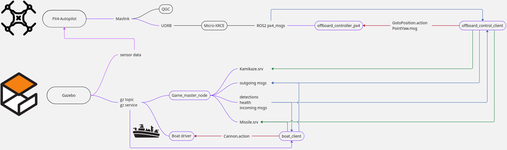
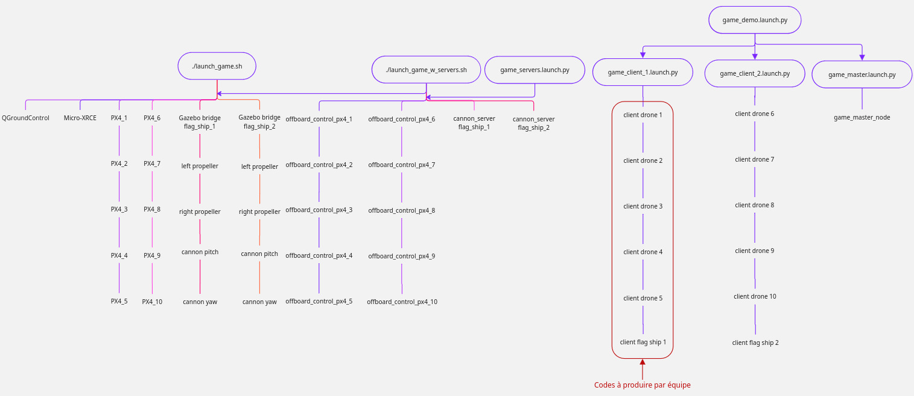

# SWARMz4: Drone and Ship Battle Challenge

## Description
SWARMz4 is a workspace for a drone and ship battle simulation environment in Gazebo. This repository provides a complete framework for multi-robot combat simulations, featuring autonomous drones and ships competing in teams. The system includes all necessary components for simulation, control, detection, communication, and game management.

## Features
- Gazebo simulation environment for drone and ship battles
- Integration with PX4, ROS2, and QGroundControl
- Custom ROS2 packages for game management
- Multi-team support with balanced team assignment
- Comprehensive detection and targeting systems
- Inter-robot communication within teams
- Missile and kamikaze attack systems
- Full simulation of physics, sensors, and combat

## System Architecture

### Data Communication
The following diagram shows the programs necessary to operate the platform and illustrates the data flow between components:


*Blue: ROS2 topics, Green: Services, Red: Actions*

### Launch Structure
This diagram shows how the launch files start all components for a full simulation:


*Each bubble represents a launch file or script. The red box highlights the code each team must implement.*

## Requirements
- Ubuntu 22.04 or higher
- ROS2 Humble
- Gazebo Garden
- PX4 Autopilot
- MAVROS
- Python 3.10+

## Installation
To install the project, follow these steps:

1. Clone the repository:
    ```bash
    git clone --recursive https://github.com/nbaudesson/SWARMz4.git
    ```

2. Navigate to the project directory:
    ```bash
    cd SWARMz4
    ```

3. Run the installation script:
    ```bash
    ./install_scripts/install_swarmz.sh
    ```
    Or, you can install each element manually with the command lines inside each component's script. In that case I recommend manually setting up the environment variable for your folder:
    ```bash
    export SWARMZ4_PATH="/path/to/SWARMz4"
    echo "export SWARMZ4_PATH=\"$SWARMZ4_PATH\"" >> ~/.bashrc
    ```

4. Build the ROS2 workspace:
    ```bash
    cd ros2_ws
    colcon build && source install/setup.bash
    ```

## Coordinate System Reference

Understanding the different coordinate systems is crucial for properly controlling drones in the simulation:

### 1. NED Frame (North-East-Down)
- **Standard aviation coordinate system**
- X-axis points to **North**
- Y-axis points to **East**
- Z-axis points **Down** (toward Earth)
- Yaw: 0° = North, 90° = East, 180° = South, 270° = West
- **Best for:** Global navigation between waypoints, coordinating multiple drones in absolute positions
- **Example:** `navigate_to(10.0, 20.0, -5.0, 90.0)` moves to 10m North, 20m East, 5m altitude, facing East

### 2. local_NED Frame
- **PX4's local reference frame**
- Origin is typically at the drone's spawn/takeoff position
- Same orientation as NED, but with a local origin
- X-axis points to **North** from origin
- Y-axis points to **East** from origin
- Z-axis points **Down** from origin
- **Best for:** Local navigation relative to takeoff point
- **Example:** `navigate_to(0.0, 0.0, -5.0, 0.0)` takes off to 5m above origin, facing North

### 3. FRD Frame (Forward-Right-Down)
- **Body-fixed frame relative to vehicle orientation**
- X-axis points to the **Front** of the drone
- Y-axis points to the **Right** of the drone
- Z-axis points **Down** from the drone
- Yaw is relative to current heading
- **Best for:** Moving relative to current heading, obstacle avoidance maneuvers
- **Example:** `navigate_to(5.0, 2.0, 0.0, 0.0)` moves 5m forward, 2m right, at same height

### 4. FLU Frame (Forward-Left-Up)
- **Body-fixed frame commonly used in robotics**
- X-axis points to the **Front** of the drone
- Y-axis points to the **Left** of the drone
- Z-axis points **Up** from the drone
- Yaw is relative to current heading
- **Best for:** Intuitive control, compatibility with robotics algorithms
- **Example:** `navigate_to(3.0, 1.0, 2.0, 0.0)` moves 3m forward, 1m left, 2m up

### Coordinate System Usage
```python
# Choose coordinate system when initializing controller
self.set_offboard_parameters(offboard_mode='position', coordinate_system='NED')

# Or set via ROS parameter when launching
ros2 run offboard_control_py offboard_control_px4 --ros-args -r __ns:=/px4_1 -p coordinate_system:=FRD
```

## Main Components

### 1. Game Master Node

The central controller for the entire simulation, managing game rules, teams, health tracking, detection, and communication.

**Key features:**
- Automatic team formation and balancing
- Health and damage management
- Simulates sensor detection ranges
- Coordinates inter-robot communication
- Manages missile firing and kamikaze attacks
- Tracks game state and declares winners

**Usage:**
```bash
ros2 launch game_master game_master.launch.py
```

### Tuning

Key performance parameters can be adjusted in configuration files:

1. **Controller Parameters**:
   ```bash
   # Set maximum horizontal speed
   ros2 run offboard_control_py offboard_control_px4 --ros-args -p horizontal_speed:=12.0
   ```

2. **Game Parameters** (in the Game Master node):
   ```bash
   # Launch with modified game parameters
   ros2 launch game_master game_master.launch.py game_duration:=3000
   ```

### 2. Boat Control System

#### Boat Driver
Provides low-level control of ship movement and cannon targeting.

**Key features:**
- Controls ship thrusters
- Manages cannon movement through action server
- Handles ship physics in water environment

#### Boat Client
Template and example implementations for ship AI control.

**Key features:**
- Detection processing to identify targets
- Cannon aiming and firing systems
- Navigation algorithms for ship movement
- Communication with teammates

**Usage:**
```bash
ros2 run boat_driver boat_client_demo --ros-args -r __ns:=/flag_ship_1
```

### 3. Drone Control System

#### offboard_control_px4
Low-level drone control interface that communicates with PX4 flight controller.

**Key features:**
- Multiple coordinate system support (NED, FRD, FLU)
- Position and velocity control modes
- Automatic takeoff and landing sequences
- Action server for trajectory control

**Usage:**
```bash
ros2 run offboard_control_py offboard_control_px4 --ros-args -r __ns:=/px4_1 -p coordinate_system:=NED
```

#### offboard_control_client_template
Template for implementing drone AI and behavior.

**Key features:**
- State machine for mission phases
- Detection processing
- Combat actions (missiles, kamikaze)
- Team communication

#### offboard_control_client_demo
Example implementation of drone control for testing.

**Usage:**
```bash
ros2 run offboard_control_py offboard_control_client_demo --ros-args -r __ns:=/px4_1
```

## Drone Control Methods

The offboard control system provides three interfaces to control the drones:

### 1. Action Server Interface (Recommended)
Provides structured control with feedback and status tracking:

```bash
# Send goal with feedback
ros2 action send_goal /px4_1/goto_position px4_controllers_interfaces/action/GotoPosition \
    "{target: {position: {x: 5.0, y: 0.0, z: -2.0}, yaw: 0.0}}" --feedback

# Send goal and wait for result
ros2 action send_goal -w /px4_1/goto_position px4_controllers_interfaces/action/GotoPosition \
    "{target: {position: {x: 5.0, y: 0.0, z: -2.0}, yaw: 0.0}}"

# Cancel goal
ros2 action cancel /px4_1/goto_position
```

### 2. Topic Interface
Direct topic publishing for simpler control:

```bash
# Position command
ros2 topic pub /px4_1/target_pose px4_controllers_interfaces/msg/PointYaw \
    "{position: {x: 5.0, y: 0.0, z: -2.0}, yaw: 0.0}"

# Velocity command (when in velocity mode)
ros2 topic pub /px4_1/target_pose px4_controllers_interfaces/msg/PointYaw \
    "{position: {x: 1.0, y: 0.0, z: 0.0}, yaw: 0.0}"
```

### 3. Programmatic Control
Use the provided template to implement control in your own code:

```python
# Navigate to position
def go_to_position(self):
    self.set_offboard_parameters(offboard_mode='position', coordinate_system='NED')
    success = self.navigate_to(10.0, 20.0, -5.0, 90.0)
    if success:
        self.get_logger().info('Moving to target position')

# Send velocity commands
def move_forward(self):
    self.set_offboard_parameters(offboard_mode='velocity', coordinate_system='FRD')
    self.send_velocity(1.0, 0.0, 0.0, 0.0)  # Forward at 1 m/s
```

## Running the Simulation

To run a complete simulation, follow these steps in order:

### 1. Start the Simulation Environment

First, launch the simulation environment with all drone and ship instances:

```bash
# From the SWARMz4 root folder
./launch_scripts/launch_game.sh
```

This script:
- Cleans up any existing processes
- Starts the MicroXRCE-DDS Agent
- Launches QGroundControl
- Creates the Gazebo world with random team positions
- Spawns all drones and ships at their respective positions
- Sets up internal communication bridges

Parameters:
```bash
./launch_scripts/launch_game.sh [HEADLESS_LEVEL] [SPAWN_FILE] [DRONES_PER_TEAM] [FIELD_LENGTH] [FIELD_WIDTH]
```

Example for GUI mode:
```bash
./launch_scripts/launch_game.sh 0
```

Example for headless mode with only GQC GUI:
(This mode worked on a ubuntu 22, GPUless laptop with 12 cores CPU and 16G of RAM)
```bash
./launch_scripts/launch_game.sh 1
```

Example for full headless mode:
```bash
./launch_scripts/launch_game.sh 2
```

### 2. Launch Control Servers

Once the simulation environment is running (wait for all drones and ships to appear in Gazebo), launch the control servers:

```bash
# In a new terminal
source ~/SWARMz4/ros2_ws/install/setup.bash
ros2 launch game_master game_servers.launch.py
```

This launches:
- Offboard controllers for all drones
- Cannon controllers for both ships

### 3. Launch Your Client Code

After servers are running, launch your custom client code:

```bash
# For a drone controller (in a new terminal)
source ~/SWARMz4/ros2_ws/install/setup.bash
ros2 run offboard_control_py offboard_control_client_demo --ros-args -r __ns:=/px4_1

# For a ship controller (in a new terminal)
source ~/SWARMz4/ros2_ws/install/setup.bash
ros2 run boat_driver boat_client_demo --ros-args -r __ns:=/flag_ship_1
```

### 4. Start the Game Master

Finally, start the Game Master to manage the game logic:

```bash
# In a new terminal
source ~/SWARMz4/ros2_ws/install/setup.bash
ros2 launch game_master game_master.launch.py
```

The Game Master will automatically:
- Detect all robots and form balanced teams
- Track health and positions
- Handle detections between robots
- Manage missile firing and kamikaze actions
- Determine the winner when time runs out or a flagship is destroyed

### All-in-One Demo Launch

Alternatively, you can use the demo launch file that handles steps 2-4 automatically:

```bash
# After launch_game.sh is running:
source ~/SWARMz4/ros2_ws/install/setup.bash
ros2 launch game_master game_demo.launch.py
```

The demo launch:
1. Starts drone and ship controllers for both teams
2. Waits a few seconds for all clients to initialize
3. Launches the Game Master to start the game

## Usage

### Game Master Demo

The Game Master Demo provides a comprehensive demonstration of the SWARMz4 simulation capabilities:

```bash
# Launch the complete demo
ros2 launch game_master game_demo.launch.py
```

The demo demonstrates:
- Drone and ship control
- Team coordination
- Detection and targeting systems
- Missile firing and kamikaze attacks
- Game timing and management

### Development Testing

For development and testing purposes, you can use:

```bash
ros2 launch game_master game_servers.launch.py  # Launch server nodes only
ros2 launch game_master game_master.launch.py   # Launch game master only
```

### Creating Custom Controllers

1. For drones: Copy and modify `offboard_control_client_template.py`
2. For ships: Copy and modify `boat_client_template.py`
3. Implement your AI and control algorithms
4. Test individual components before full integration

## Game Rules

- Two teams compete: each with 5 drones and 1 flagship ship
- Objective: Destroy the enemy flagship or have more health at the end of the time limit
- Drones have 1 health point, ships have 6 health points
- Drones can fire missiles (2 per drone) or self-destruct (kamikaze)
- Ships can fire missiles (4 per ship)
- Each robot can only detect others within specific ranges
- Communication range is limited between teammates
- Game ends when a flagship is destroyed or time (5 minutes) runs out

## Results and Replays

Game results are saved to:
- `~/SWARMz4/results/game_results.txt` (cumulative)
- `~/SWARMz4/results/individual_games/` (per-game)

You can replay a game using:
```bash
ros2 bag play ~/SWARMz4/results/bags/game_state_<timestamp>
```

### Monitoring and Debugging

Here are some useful topics that provide information about your drone's status:

1. **View Robot Status**:
   ```bash
   # Health status
   ros2 topic echo /px4_1/health

   # Position
   ros2 topic echo /px4_1/fmu/out/vehicle_local_position
   ```

2. **Game Status**:
   ```bash
   # Remaining game time
   ros2 topic echo /game_master/time

   # Game state (includes all robot statuses)
   ros2 topic echo /game_master/game_state
   ```


## Documentation Resources

For more information about the components used in this project:

- **PX4**: 
  - [ROS 2 User Guide](https://docs.px4.io/main/en/ros2/user_guide.html)
  - [PX4 Offboard Mode Guide](https://docs.px4.io/main/en/flight_modes/offboard.html)

- **ROS2**: 
  - [ROS 2 Humble Documentation](https://docs.ros.org/en/humble/index.html)

- **Gazebo**: 
  - [PX4 Multi-Vehicle Simulation with Gazebo](https://docs.px4.io/main/en/sim_gazebo_gz/multi_vehicle_simulation.html)