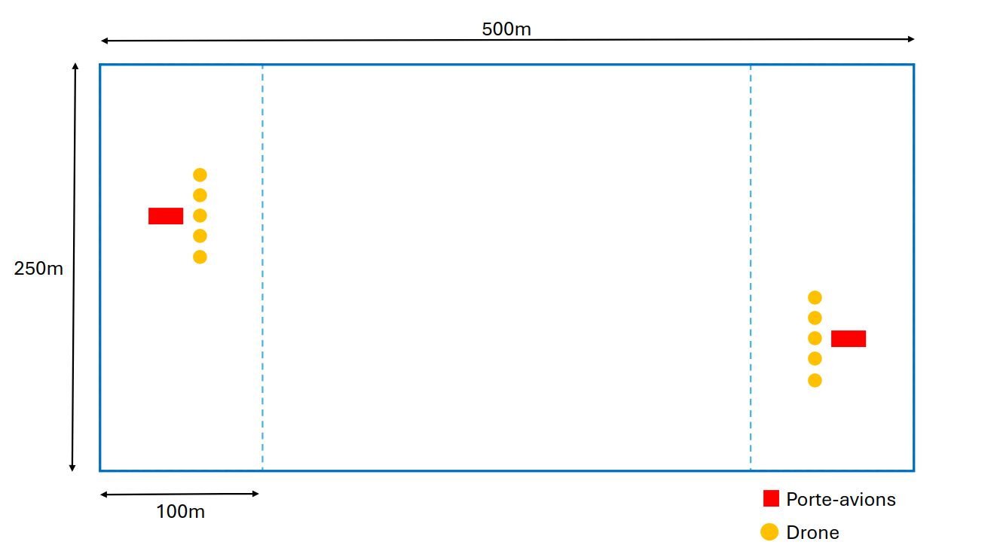

# Règlement SWARMz CUP

## Défi :
Dans une piscine virtuelle de 500m x 250m et 250m de hauteur, deux équipes de drones aériens s'affrontent pour protéger leur porte-avion (unité précieuse) flottant à la surface de l'eau. Chaque équipe doit défendre son porte-avions tout en manœuvrant ses drones pour neutraliser le porte-avions de l'adversaire. Stratégie de défense, d'attaque et de communication seront déterminantes pour remporter la victoire.\
La partie dure 5 minutes et c'est la première équipe à avoir neutralisé le porte-avions adverse qui remporte la partie. Un cas de non-neutralisation, c'est le nombre de P.V. retirés à l'adversaire qui est pris en compte (drones neutralisés et P.V. retirés au porte-avions). S'il y a égalité du nombre de P.V. retirés, c'est l'équipe ayant retiré le plus de P.V. au porte-avions adverse qui remporte la victoire.

## Initialisation :
Au début de la partie, les porte-avions et leur flotte de drones sont générés de manière aléatoire de part et d'autre de la piscine dans une zone correspondant à 20 % de celle-ci.

## Sources de dégâts :
**Explosions :** les drones sont des drones kamikazes qui peuvent exploser pour infliger des dommages dans une sphère de 5m de rayon autour d'eux. Cette explosion inflige 3 points de dégâts.\
**Missiles :** les missiles sont des missiles lasers qui infligent 1 point de dégât. Leur zone de dégâts est sous la forme d'un cône de longueur de variable en fonction du type de lanceur (drone ou canon du porte-avions).

## Composition d'une équipe :
Chaque équipe est composée de 5 drones possédant chacun 1 point de vie (P.V.) et d'un porte-avions possédant 6 P.V.

## Vitesse de déplacement :
### Porte-avions :
- Vitesse de déplacement linéaire : 1 m/s
- Vitesse de rotation du canon : 0,26 rad/s

### drones :
- Vitesse de déplacement linéaire : 12 m/s 

## Détection :
### Porte-avions :
- Portée de détection du bateau adverse : 500m
- Portée de détection des drones adverses : 162m

### drones :
- Portée de détection : 137m

## Communication :
Les canaux de communication sont communs aux deux équipes. 
### Porte-avions :
- Portée de communication : 525m (portée de détection x 1.05)

### Drones :
- Portée de communication : 144m (portée de détection x 1.05)

## Tir :
### Porte-avions :
- Portée de tir : 81m (portée de détection x 0.5)
- Temps de rechargement : 6 secondes
- Nombre de missiles : 6

### Drones :
- Portée de tir : 69m (portée de détection x 0.5)
- Temps de rechargement : 8 secondes
- Nombre de missiles : 2

## Hitbox :
- **Porte-avions :** 6m x 1m x 1m
- **Drones :** pavé de 0.5m de côté

## Résumé :
### - Porte-avions : 
- Point de vie : 6
- Vitesse de déplacement linéaire : 1 m/s
- Portée de détection du bateau adverse : 500m
- Portée de détection des drones adverses : 162m
- Portée de communication : 525m (portée de détection x 1.05)
- Portée de tir du canon : 81m (portée de détection x 0.5)
- Vitesse de rotation du canon : 0,26 rad/s
- Temps de rechargement du canon : 6 secondes
- Nombre de missiles : 6
- Hitbox : pavé de 6m x 1m x 1m

### - Drones :
- 5 par équipes
- Point de vie : 1
- Vitesse de déplacement linéaire : 12 m/s
- Portée de détection : 137m
- Portée de communication : 144m (portée de détection x 1.05)
- Portée de tir : 69m (portée de détection x 0.5)
- Temps de rechargement : 8 secondes
- Hitbox : pavé de 0.5m de côté
- Rayon d'explosion : 5m
- Nombre de missiles : 2
