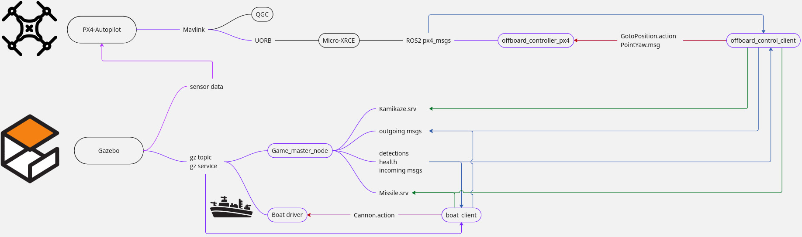
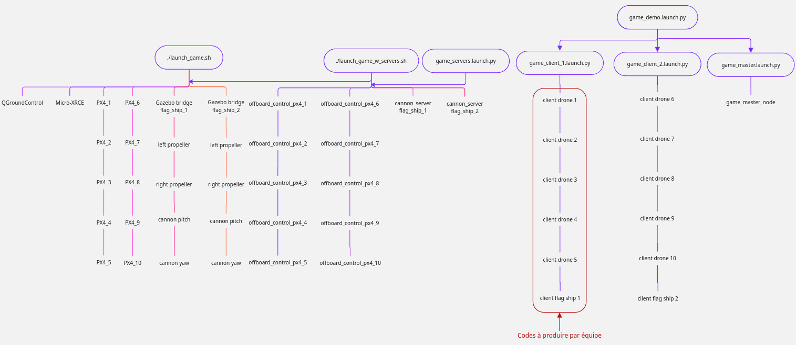

# Game Master Package

This ROS2 package manages a multi-robot combat simulation in Gazebo. It handles teams of drones and ships, tracking health, detection, communication, and game state publication to replay your game.

---

## System Overview

- **Two teams**: Each with 5 drones and 1 flagship ship.
- **Objective**: Destroy the enemy flagship or have more health/drones at the end.
- **Game Master Node**: Central controller for all game logic, health, detection, communication and results.
---

## Diagram: 

### Data architecture

The following diagram shows the programs necessary to operate the platform and show the data generated by these programs and to whom they communicate. (blue : topics, green : service, red : action)




### Launch Structure

The following diagram shows how the launch files start all components for a full simulation:



- Each bubble is a launch file or script.
- Drones and ships are grouped by team.
- The branches show which nodes/programs are started by each launch file.
- The red box highlights the code each team must provide drone/ship clients. Either provide 6 codes that would work for either teams (West side and East side) or 12 specifying which one would work for each team. You can also provide your own launchers for you client codes.

---

## Launch Files Explained

### 1. `game_demo.launch.py`
**Purpose:** Launches a full game demo with all teams, ships, drones, and the game master.
- Starts both teams' clients and the game master node.
- Adds a delay to ensure clients are ready before the game master starts, as the game only last for 5 mins.

**Usage:**
```bash
ros2 launch game_master game_demo.launch.py
```

---

### 2. `game_demo_client_1.launch.py` and `game_demo_client_2.launch.py`
**Purpose:** Launches all client nodes for one team (5 drones + 1 ship).
- Each drone and ship gets its own namespace and node.
- Team 1 uses `game_demo_client_1.launch.py`, Team 2 uses `game_demo_client_2.launch.py`.

**Usage:**
```bash
ros2 launch game_master game_demo_client_1.launch.py team_id:=1
ros2 launch game_master game_demo_client_2.launch.py team_id:=2
```

---

### 3. `game_master.launch.py`
**Purpose:** Launches only the Game Master node.
- Handles all game logic, health, detection, communication, and results.
- Loads parameters from `game_master_params.yaml`.

**Usage:**
```bash
ros2 launch game_master game_master.launch.py
```

---

### 4. `game_servers.launch.py`
**Purpose:** Launches all server nodes needed for the game.
- Starts offboard control servers for all drones.
- Starts cannon servers for both ships.

**Usage:**
```bash
ros2 launch game_master game_servers.launch.py
```

---

## Game Logic Summary

- **Teams**: Automatically formed from detected robots (balanced as much as possible).
- **Health**: Drones have 1 HP, ships have 6 HP.
- **Detection**: Each robot can detect others within a certain range (drones/ships have different ranges).
- **Communication**: Robots can send messages to teammates within range.
- **Weapons**: Drones and ships can fire missiles (with cooldown and ammo limits).
- **Kamikaze**: Drones can self-destruct to damage nearby robots.
- **Game End**: When a flagship is destroyed or time runs out. Winner is determined by flagship health, then drone count, then draw.

---

## Configuration

Edit `game_master_params.yaml` to adjust:
- Detection/communication ranges
- Health values
- Game duration
- Missile and kamikaze parameters

---

## Results

- Results are saved in `~/SWARMz4/results/game_results.txt` (cumulative) and `~/SWARMz4/results/individual_games/`.
- Each game is numbered and includes team health, surviving/destroyed drones, and the winner.

---

## Example Service Calls

Fire a missile:
```bash
ros2 service call /game_master/fire_missile swarmz_interfaces/srv/Missile "{robot_name: '/px4_1'}"
```

Trigger kamikaze:
```bash
ros2 service call /game_master/kamikaze swarmz_interfaces/srv/Kamikaze "{robot_name: '/px4_2'}"
```

---

## Interface

Each robot interacts with the game master and other robots through dedicated ROS2 topics and services. The topics are namespaced for each robot.

### Topics per Robot

- **Health:**  
  `/px4_X/health` or `/flag_ship_X/health`  
  *(std_msgs/Int32)*  
  Current health points of the robot.

- **Detections:**  
  `/px4_X/detections` or `/flag_ship_X/detections`  
  *(swarmz_interfaces/Detections)*  
  List of detected robots within "fake" sensor range. The coordinates are expressed in FRD (Front Right Down) from the robots perspective

- **Communication:**  
  - Outgoing: `/px4_X/out_going_messages` or `/flag_ship_X/out_going_messages` *(std_msgs/String)*  
    Send messages to teammates within communication range.
  - Incoming: `/px4_X/incoming_messages` or `/flag_ship_X/incoming_messages` *(std_msgs/String)*  
    Receive messages from teammates.

- **Localization (Boats only):**  
  `/flag_ship_X/localization` *(geometry_msgs/Pose)*  
  Current position and orientation of the ship in the world coordinate frame (0,0) being South West.

### Message Formats

- **Health:**  
  `std_msgs/Int32`  
  ```
  data: int32  # Health points
  ```

- **Detections:**  
  `swarmz_interfaces/Detections`  
  ```
  header: std_msgs/Header
  detections: swarmz_interfaces/Detection[]
  ```
  Each `Detection` contains:
  ```
  int8 vehicle_type    # 0=DRONE, 1=SHIP
  bool is_friend       # True if detected robot is on the same team
  geometry_msgs/Point relative_position  # In Forward-Right-Down (FRD) frame
  ```

- **Communication:**  
  `std_msgs/String`  
  ```
  data: string  # Message content
  ```

- **Localization:**  
  `geometry_msgs/Pose`  
  ```
  position: geometry_msgs/Point
  orientation: geometry_msgs/Quaternion
  ```

---
